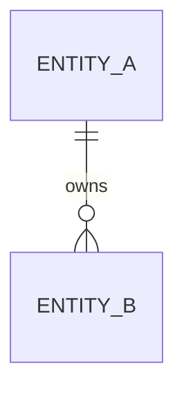
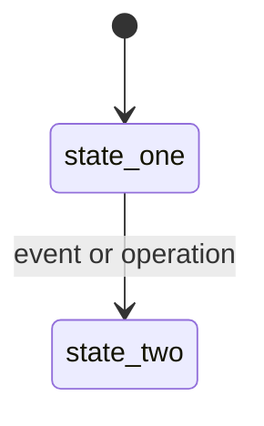
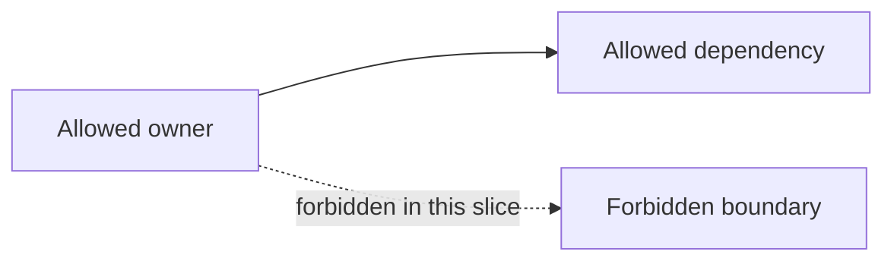

# 03-dataflow.md

Use when the work changes runtime flow, event flow, ownership, or cross-service behavior.

Include:

- before flow
- after flow
- call ownership
- IO boundaries
- where effects happen
- batch or ordering constraints
- entity relationships when the work changes persistence or ownership
- state changes when lifecycle state changes
- boundary diagrams when crossing or protecting service boundaries
- diagrams for multi-step flows

Mermaid diagrams are useful when they expose ownership, sequencing, entity relationships, lifecycle states, or service boundaries. Do not add decorative diagrams.

## Template

````md
# Dataflow

## Before


## After


## Entity relationship

Use when the work changes persisted entities, ownership, or lineage.



## State changes

Use when the work changes lifecycle state, terminal states, retry states, or temporary validation states.



## Boundaries

Use when the work must cross, preserve, or forbid a service/provider/subscriber/scheduler boundary.



## Ownership

...

## IO boundaries

...

## Ordering constraints

...
````
